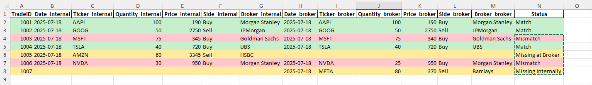

# Trade Reconciliation Tool

A practical finance/operations project using Python, SQL, and Excel to reconcile internal vs. broker trade records.

## 🚀 Features
- Match trades across systems
- Flag mismatches (price, quantity, missing trades)
- Generate Excel reports with conditional formatting

## 🧰 Tech Stack
- Python (`pandas`, `openpyxl`)
- SQL (SQLite or PostgreSQL)
- Excel (for final reporting)

## 📂 Structure
- `data/`: sample trade data (CSV)
- `scripts/`: SQL + Python automation
- `docs/`: visuals, notes, diagrams

---

## 🔍 Example Use Case
Used in financial operations to reconcile trade flow, generate compliance reports and automate manual checks.

## 📸 Preview
**

- TradeID 1003: Mismatch - Price differs between broker and internal records
- TradeID 1005: Missing at Broker: Trade exists in the internal system but not on the brokers side
- TradeID 1006: Quantity mismatch between internal records and broker
- TradeID 1007: Trade not registered internally